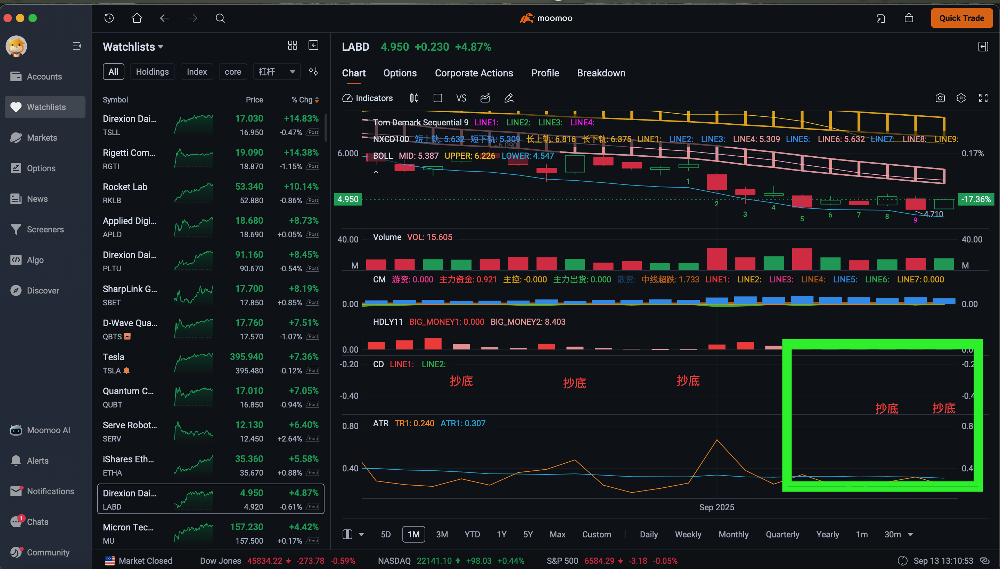

## Moomoo OCR Monitor
This project monitors a specific region of your screen for Chinese trading signals (like "抄底" - bottom fishing/buy the dip, or "卖出" - sell) in the Moomoo trading app, and sends SMS alerts when these terms are detected.

## Features
- Takes periodic screenshots of a configurable screen region
- Processes images with multiple techniques to optimize for colored text on dark backgrounds
- Uses EasyOCR for Chinese/English text recognition
- Sends SMS alerts via Vonage
- Displays macOS notifications
- Maintains detailed logs of detected terms and OCR results
- Saves processed images and the original screenshot, as well as the log file `ocr_log.txt`, in the `screenshots` folder

## Prerequisites
- macOS (uses macOS-specific screenshot commands)
- Python 3.13+
- `ImageMagick` (for image preprocessing)
- Vonage account for SMS capabilities (a free trial account is sufficient)  

## Installation
1. Clone the repository
```
git clone https://github.com/tonypeng1/moomoo.git
cd moomoo
```

2. Install dependencies using uv
`uv` is a fast Python package installer and resolver. If you don't have it installed:
```
curl -LsSf https://astral.sh/uv/install.sh | sh
```

If your system doesn't have curl, you can use wget:
```
wget -qO- https://astral.sh/uv/install.sh | sh
```

Then install the project dependencies:
```
uv pip install -e .
```

3. Create and activate a virtual environment

```bash
# Create a virtual environment in a hidden folder named '.venv'
uv venv .venv

# Activate the virtual environment
# On macOS/Linux:
source .venv/bin/activate

# On Windows:
# .venv\Scripts\activate
```

4. Make scripts executable
```
chmod +x ocr_monitor.sh
chmod +x helper_scripts/*.py
```

## Configuration
### API Keys
Create a `.env` file in the project root directory with your Vonage credentials:
```
VONAGE_API_KEY="your_api_key_here"
VONAGE_API_SECRET="your_api_secret_here"
VONAGE_FROM="YourSender"
VONAGE_TO="+1YYYYYYYYYY"
```

### Screen Coordinates
By default, the script monitors a 270×190 pixel area starting at coordinates (1150, 620). To customize this for your screen, change the following values.
```
CROP_X=1150          # X position (from left)
CROP_Y=620           # Y position (from top)
CROP_WIDTH=270       # Width of capture area in pixels
CROP_HEIGHT=190      # Height of capture area in pixels
```
Current default monitor area is shown in the image below at the lower-right corner when the Moomoo app is displayed full screen.


### Search Terms
The default Chinese terms being monitored are "抄底" (bottom fishing/buy the dip) and "卖出" (sell). You can modify these in `ocr_monitor.sh`:
```
SEARCH_TERMS=("抄底" "卖出")  # Terms mean "bottom fishing" and "sell"
```

### macOS Notifications Setup
If macOS notification is not shown, try:

1. Open Script Editor (located in `/Applications/Utilities/`)
2. Paste this code:
```applescript
display notification "Test notification" with title "Test"
```
3. Run the script by clicking the "Run" button in Script Editor
4. Click `Options` in the notification that appears in the upper-right corner of the screenand and select `Allow` 
5. Check System Preferences → Notifications to verify "Script Editor" appears and is allowed

### Usage
1. Run Once
```
sleep 5 && ./ocr_monitor.sh
```

2. Run Continuously
Specify an interval in minutes:
```
./ocr_monitor.sh 30    # Check every 30 minute
```
Press `Ctrl+C` to stop monitoring.

## How It Works
1. The script takes a screenshot of the specified region
2. It applies multiple preprocessing techniques to enhance text visibility:
   - Red channel enhancement
   - Green channel enhancement
   - HSV-based color extraction (specialized for colored text on dark backgrounds)
   - Luma (brightness) enhancement
3. Each processed image is analyzed with `EasyOCR`
4. If target Chinese terms are found, an SMS alert is sent and a macOS notification is displayed
5. All activities are logged to `ocr_log.txt`
6. The original screenshot and processed images, as well as the log file `ocr_log.txt`, are saved in the `screenshots` folder for reference and debugging

## Troubleshooting
- Check `ocr_log.txt` for detailed information about each OCR attempt
- Ensure the screen coordinates are correctly set for your display
- Verify your Vonage credentials in the `.env` file
- Make sure `ImageMagick` is properly installed and in your PATH

## License
MIT License